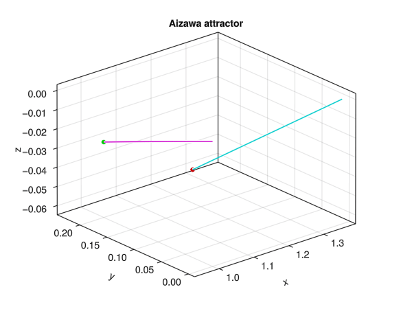

# ChaoticStrangeAttractors.jl



## Installation

```julia
using Pkg
Pkg.add(url = "https://github.com/Sagnac/ChaoticStrangeAttractors.jl")
```

## Usage

```julia
using ChaoticStrangeAttractors
attractor = Rossler(a = 0.2, b = 0.2, c = 5.7, x = 7, y = 0, z = 0)
attract!(attractor, t = 200)
```

```julia
# attractor field
lorenz = attract!([Lorenz(; x) for x ∈ 6:8])
```

```julia
# instantiate a system's trajectory at time t
attract!(Sprott(), Instantiate(65))
```

```julia
# encode
attract!("rossler.mp4", Rossler(), t = 54)
```

***Right clicking on the figure will start / stop the dynamics.***

## Currently implemented attractors

* Rössler
* Lorenz
* Aizawa
* Sprott
